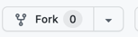
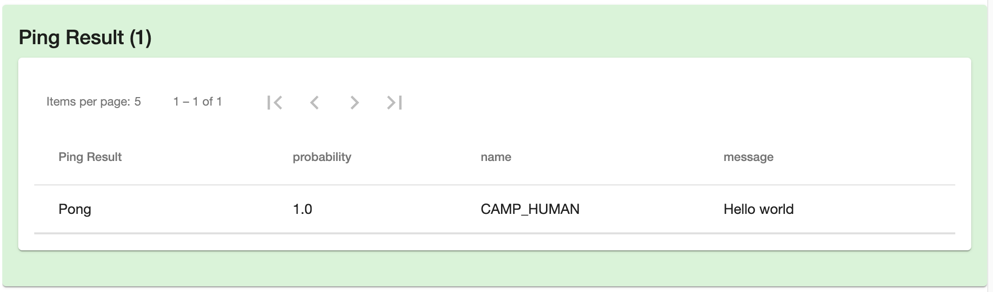
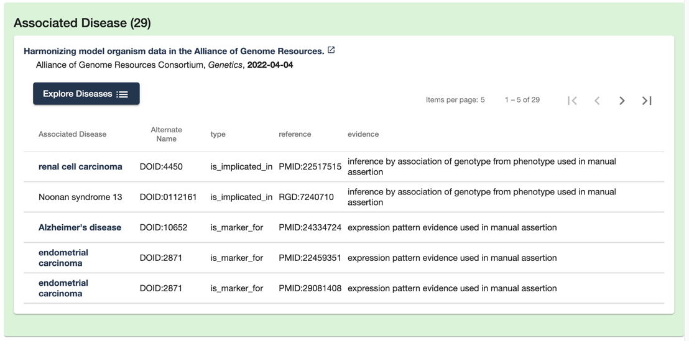

# pharos-community-data-api
A test API to be used for Pharos' dynamic predictions functionality.

# Tutorial 
### Build and Run this code
1. Fork this repo from the GitHub UI
    * 
    * Select your account as the owner
2. Check out your fork locally
    ```aidl
    git clone https://github.com/{{your github ID}}/pharos-community-data-api
    ```
3. Navigate to source code directory
   ```aidl
   cd /pharos-community-data-api
   ```
4. Install all dependencies
    ```
    npm install
    ```
5. **OPTIONAL - Build Kinase-Cancer-Predictions endpoint**
    * download MESH IDs
       ```aidl
       curl https://nlmpubs.nlm.nih.gov/projects/mesh/MESH_FILES/xmlmesh/desc2022.xml > desc2022.xml
       ```
    * build lookup tables for Kinase-Cancer Predictions
       ```aidl
       cd data_sources/kinase-cancer-predictions
       node build
       cd ../..
       ```
6. **THE OTHER OPTION - Skip building Kinase-Cancer-Predictions endpoint**
    * Alternatively, you can comment out the following lines from app.ts
    ```
    import {predictions} from "./data_sources/kinase-cancer-predictions/index"
    ...
    app.get("/predictions?*", (req: Request, res: Response) => predictions(req, res));
    ```
7. Install typescript if you haven't already
    ```aidl
    npm install -g typescript
    ```
8. Compile the typescript and run the app
    ```aidl
    tsc && node app
    ```
9. Verify it works.
    * Navigate to:
        ```aidl
        http://localhost:3001/ping
        ```
    * it should return some JSON
10. Hit your API from the Pharos Development deployment
    * Navigate to:
    ```aidl
    https://pharos-frontend-dev.appspot.com/toolbox
    ```
    * Choose a target, disease, or ligand from the search box
    * enter your API into the API Url field
    * add some query parameters
    * add some fields in curly braces (i.e. {name}) to pass data from Pharos to your API
    ```aidl
    http://localhost:3001/ping?name={name}&message=Hello world
    ```
    * see the preview of how the API results will look on a Pharos details page
      

### Add your own endpoint
Here are the steps for creating your own endpoint. As an example, it downloads data from Alliance Genome for display on Disease Details pages.
See the GitHub branch called "tutorial" for finished example for reference (note, you'd still have to download the data and build the lookup file to run the API).
1. Download target-disease associations from Alliance Genome and unzip it in a new folder ```./data_sources/alliance-genome```
    ```aidl
    mkdir ./data_sources/alliance-genome
    curl https://download.alliancegenome.org/5.3.0/DISEASE-ALLIANCE-JSON/HUMAN/DISEASE-ALLIANCE-JSON_HUMAN_25.json.gz > ./data_sources/alliance-genome/disease-alliance-json_human_25.json.gz
    gunzip ./data_sources/alliance-genome/disease-alliance-json_human_25.json.gz
    ```
 
2. Write a build script to format the data for easy access
    * in the /data_sources/alliance-genome folder, create a file called ```build.ts```
    * at the top of build.ts, read the unzipped input file
    ```aidl
    const rawData = require('./disease-alliance-json_human_25.json');
    ```
    * Next, build a map so that we can access the data given a gene symbol
        * gene symbol is held in the ```DBObjectSymbol``` field of each object in the data array
        * iterate through the data in ```rawData.data``` and build a Map object holding the relevant data 
    ```aidl
    const targetLookup: Map<string, any[]> = new Map<string, any[]>();
    rawData.data.forEach((row: any) => {
        let associations: any = [];
        if (targetLookup.has(row.DBObjectSymbol)) {
            associations = targetLookup.get(row.DBObjectSymbol);
        } else {
            targetLookup.set(row.DBObjectSymbol, associations);
        }
        associations.push({
            type: row.AssociationType, // i.e. is_marker_for, is_implicated_in, etc.
            diseaseID: row.DOID,
            diseaseTerm: row.DOtermName,
            evidenceCode: row.EvidenceCode,
            evidenceCodeName: row.EvidenceCodeName,
            reference: row.Reference // can be PMID, RGD, MGI
        });
    });
    ```    
   * Save ```targetLookup.get(geneSymbol)``` to a file so that the API can load it and it will be ready to fetch the 
   data when a request for diseases associated with a particular gene symbol
    ```
    const { replacer } = require("../kinase-cancer-predictions/utilities");
    fs.writeFileSync(__dirname + '/targetLookup.json', JSON.stringify(targetLookup, replacer));
   ```
3. Compile the typescript code, and run the ```build``` script to create ```targetLookup.json```
   ```
   tsc && node build
   ```
   
4. Create the API that will serve the data
    * In the same directory, create a file called ```index.ts```
    * Load the targetLookup file created by the build script
   ```aidl
    import fs from "fs";
    const {reviver} = require("../kinase-cancer-predictions/utilities");
    const targetLookup = JSON.parse(fs.readFileSync(__dirname + '/targetLookup.json', {encoding: "utf-8"}), reviver);
    ```
   * create the endpoint that will serve the data
     * you should make sure to call setHeaders, or do everything setHeaders does
   ```aidl
    import {Request, Response} from "express";
    import {setHeaders} from "../../models/endpoints";
    export function associations(req: Request, res: Response): any {
        setHeaders(res);
        res.end("Hello world!"); // TODO - serve target disease associations instead
    }
    exports.associations = associations;
    ```
   * edit ```app.ts``` to add a route for your new endpoint
   ```aidl
    import {associations} from "./data_sources/alliance-genome/index"
    app.get("/associations?*", (req: Request, res: Response) => associations(req, res));
    ```
    * visit ```localhost:3001/associations``` to make sure everything is working
    * after the call to ```setHeaders```, fetch the appropriate dataset, given an input argument. the whole function should look like this at this point:
   ```aidl
    export function associations(req: Request, res: Response): any {
        setHeaders(res);
        const parsedUrl = url.parse(req.url);
        const queryMap = querystring.parse(parsedUrl.query);

        if (queryMap.target) {
            const targetQuery = queryMap.target.toString();
            const associations = targetLookup.get(targetQuery);
            const formattedAssociations = associations; // TODO - format with JSON-LD
            res.end(JSON.stringify(formattedAssociations));
            return;
        }
        res.end("No target provided!");
    }
    ```
   * restart your server with ```tsc && node app``` and test in the browser again
     * Example: ```http://localhost:3001/associations?target=CAMK2A```
     * It should show a JSON object with data from alliance genome
   * Format the JSON object for Pharos consumption, use the helper functions to help ensure the structured data is properly structured
   ```aidl
   if (queryMap.target) {
        const targetQuery = queryMap.target.toString();
        const associations = targetLookup.get(targetQuery);
        if (associations && associations.length > 0) {
            const ps = new PredictionSet("Associated Disease", "MedicalCondition", "evidence",
                "An ECO code representing the evidence for the association", null, null);
            associations.forEach((assoc: any) => {
                const extraFields: any =
                {
                    identifier: [
                    {
                        "@type": "PropertyValue",
                        "name": "type",
                        "value": assoc.type
                    },
                    {
                        "@type": "PropertyValue",
                        "name": "reference",
                        "value": assoc.reference
                    }]
                };
                ps.addPrediction(assoc.diseaseTerm, assoc.diseaseID, assoc.evidenceCodeName, extraFields);
            });
            ps.addCitation(getMinimalCitation(35380658));
            res.end(JSON.stringify([ps.asJSON()]));
            return;
        }
    }
    ```
     * This code creates a PredictionSet object, where the data you are reporting is a "Associated Disease"
       which is a standard @MedicalCondition object (as defined by schema.org). The confidence metric will be called 
       "evidence" with a better description of the of that confidence metric as well.
     * Later, we loop through all the associations that Alliance Genome has for this target
       format a couple of the fields we want to show into the "identifier" property of the @MedicalCondition object.
       Then we add the association data to the PredictionSet object
     * We add the citation to the PredictionSet using the PMID that Alliance Genome likes to be cited by.
     * Finally, we return a string formatted version of the PredictionSet object from our API
5. Restart your server with ```tsc && node app``` and test in the browser again
   Example: http://localhost:3001/associations?target=CAMK2A
   It should show a JSON object with data from alliance genome  
6. Go back to the Pharos Toolbox ```https://pharos-frontend-dev.appspot.com/toolbox``` and enter your localhost API 
into the API Url field. 
   * Replace the gene symbol with the wildcard {sym} so that Pharos will call your API using the appropriate gene 
   symbol for the target details page that is being shown 
   * ```http://localhost:3001/associations?target={sym}```
   * Select a Target from the Search box at the top, and watch the magic.
   * 
7. You should see:
   * A link and blurb about the citation you provided in the PredictionSet object
   * A link to explore diseases - this navigates to a disease list page, where diseases are resolved based on the DOIDs in your list
   * A pageable table of disease associations for this target, as reported by Alliance Genome
   * The table headers correspond to the text provided to the constructor of the PredictionSet object
   * The "identifiers" given are shown as columns in the table, allowing a user to know a target "is_implicated_in" a particular disease
   * For diseases, Pharos links to each disease details page when there is one

### Options
1. You can also display your data in a card view by specifying the format ("table" or "card") when you create the PredictionSet object
   ```aidl
    const ps = new PredictionSet("Associated Disease", "MedicalCondition", "evidence",
    "An ECO code representing the evidence for the association", null, null, "card");
    ```
2. If you wanted to take it further, you could also build a diseaseLookup table and add functionality to return a set of Associated Targets when Pharos presents 
 a disease details page

## Caveats
1. The "Preview on Page" functionality only works with APIs deployed to the internet somewhere. See the next step for a way to do that relatively easily. The Pharos backend doens't have 
 the ability to query your localhost. It took a bit of magic for the Toolbox page to be able to do that, that the "Preview on Page" functionality doesn't do.

## Integrate your data into Pharos
The easiest way would be to do your development in a fork of this repo, and submit a pull request. We can add your API to our GCP functions to host it. 
   * We'll review the technical aspects of the code, and the quality and nature of the data being displayed, based on the 
   Criteria for Predictive Models that is available on our FAQ page (https://pharos.nih.gov/faq).
   * Reach out to us at pharos@mail.nih.gov early in your development, and let us know what questions you have
    and if there's any functionality you'd like to see added.
